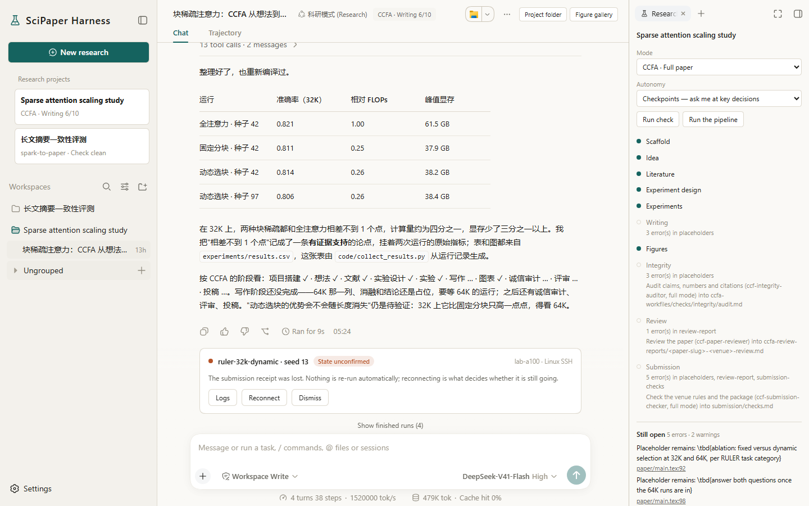
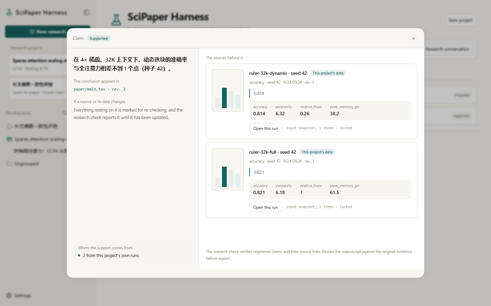
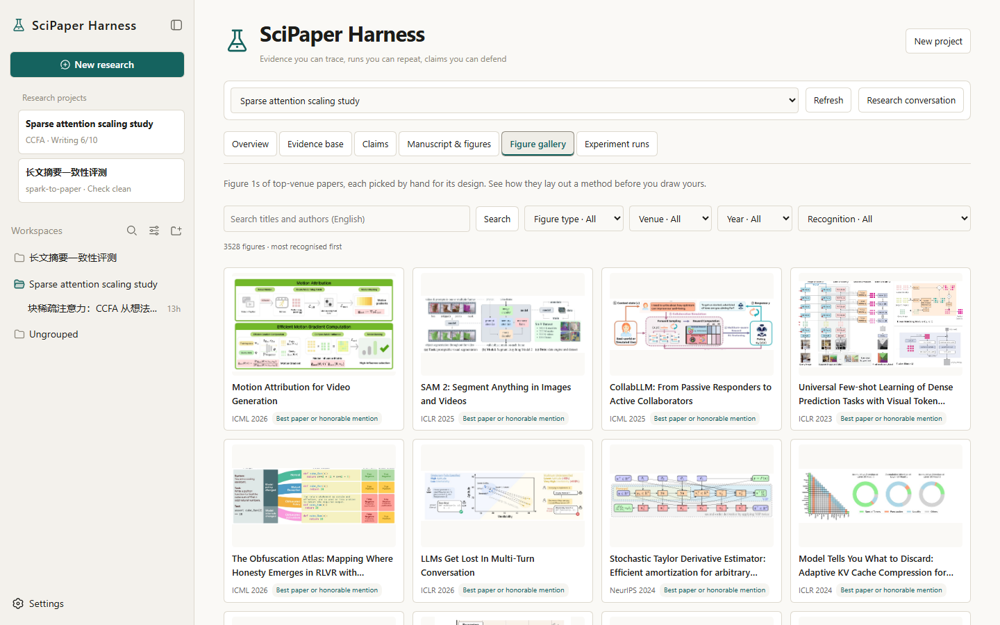

# SciPaper Harness

English | [中文](README.zh.md)

**From a spark to a paper that survives review.**

A desktop research agent that reads the literature, runs your experiments and writes the paper, and shows you the evidence behind every claim it makes.

  
  
  
  

<a href="https://github.com/M-24rjgc/SciPaper-Harness/releases"><strong>Download for Windows</strong></a>

## Why researchers use it

- **Every claim shows its evidence.** Open any conclusion and see the page, the quote or the experiment run behind it. When a source changes, everything built on it is flagged until it is brought up to date.
- **Numbers come from real runs.** Experiments run in your own Python environments, on this machine or over SSH, keep going after you close the window, and every table cell traces back to the run that produced it.
- **Start from wherever you are.** A one-line idea, a proposal, or a folder of PDFs, data and logs.
- **You decide how often it asks.** Stop at the key decisions, or let it carry the paper through on its own.

## Everything a paper needs, in one place

- **Literature you can cite.** References are verified through Crossref, OpenAlex and arXiv, with the open-access full text beside them.
- **Your venue's template.** 139 CCF venues with their official style files, compiled and checked page by page.
- **Figures reviewers remember.** About 3,500 hand-picked Figure 1s from top venues to learn from, image drafts from gpt-image-2, and editable SVG or draw.io figures exported to vector PDF.
- **Proven methods, built in.** spark-to-paper and CCFA guide a whole paper phase by phase; the general mode gives you every tool with no fixed pipeline.
- **A map of research ideas.** A knowledge graph of problem-to-solution patterns finds the closest work and tells you how new your idea is.

## Get started

1. Download the installer from the [Releases page](https://github.com/M-24rjgc/SciPaper-Harness/releases).
2. Add your model provider's key in Settings.
3. Tell it what you are working on.

It keeps itself up to date. The [install and update guide](docs/user/guide/install-and-update.md) covers the details.

## Preview

SciPaper Harness is an internal-test preview: releases may break compatibility, and the installer is not code-signed yet. Read the [safety notice](SAFETY.md) before running it, and tell us what works and what does not in [Issues](https://github.com/M-24rjgc/SciPaper-Harness/issues).

## For developers

[Build from source](docs/user/guide/install-and-update.md#build-from-source) shows how to build the installer and publish a release; the [development guide](docs/development.md) and the [architecture documentation](docs/architecture.md) explain the code.

## Credits

- [DeepSeek Harness](https://github.com/deepseek-ai/deepseek-harness) by DeepSeek, whose 0.1.6-alpha.1 release this application began from, under the MIT licence. SciPaper Harness is an independent project, not affiliated with or endorsed by DeepSeek.
- [spark-to-paper-skills](https://github.com/Spark-To-Paper-Skills/spark-to-paper-skills) and [CCFA-Skills](https://github.com/mikubaka88/CCFA-Skills), the methods behind the two mode packs, under the MIT licence; see each pack's `NOTICE.md`.
- [Top-Conf Figure Gallery](https://github.com/qwdwqfwq/topconf-paper-figure-gallery), whose index the figure gallery ships; every figure keeps its paper's copyright.

## License

[MIT](LICENSE), keeping DeepSeek's copyright notice for the harness. Third-party dependencies and their licenses are disclosed in [THIRD_PARTY_NOTICES.md](THIRD_PARTY_NOTICES.md).
