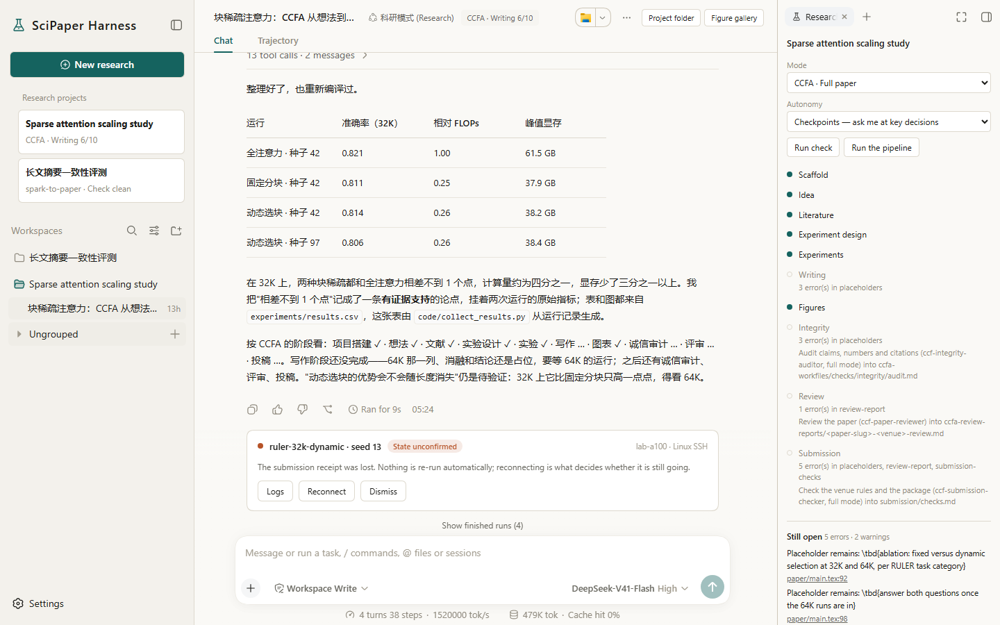
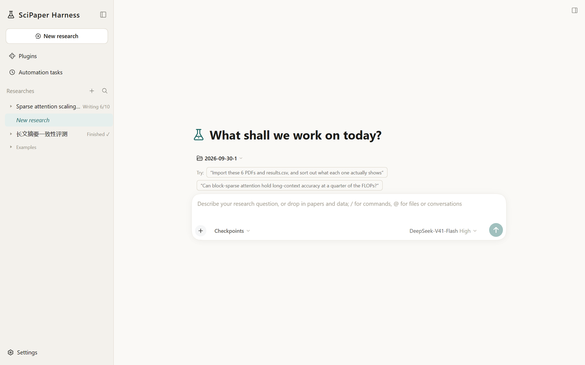
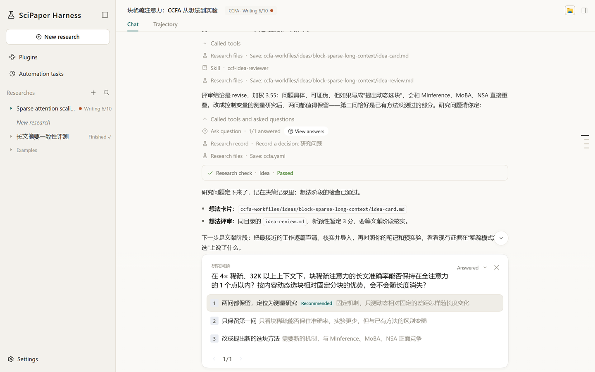
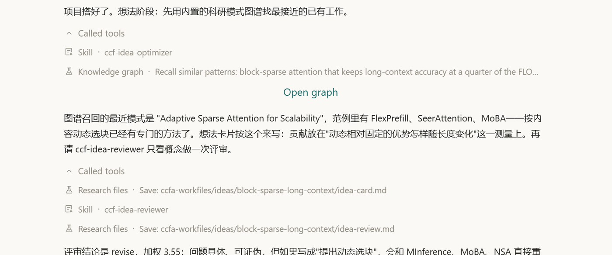
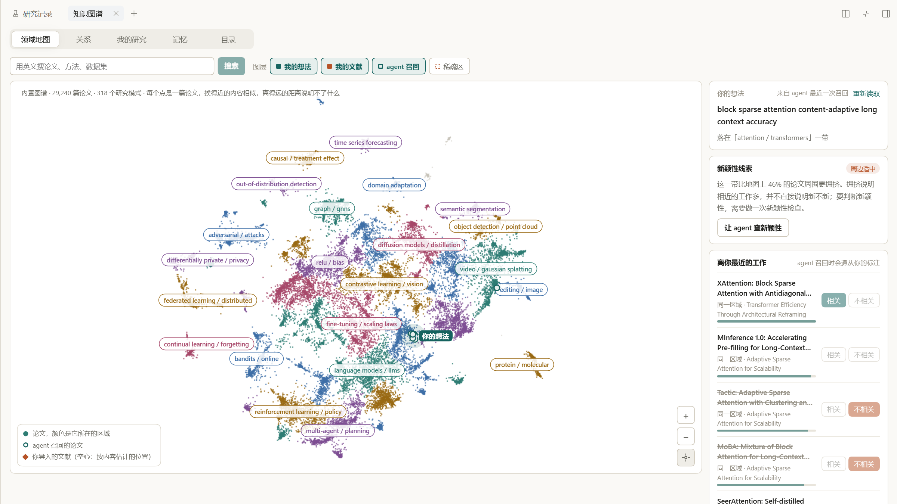
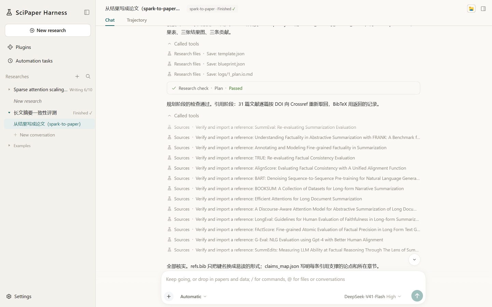
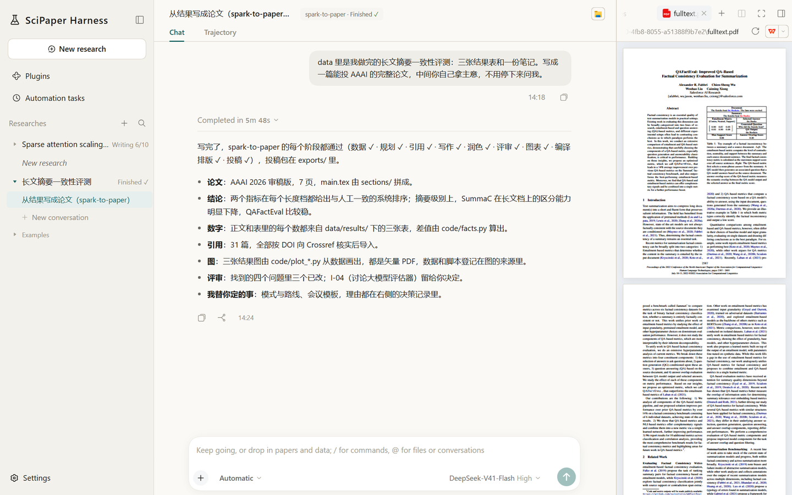
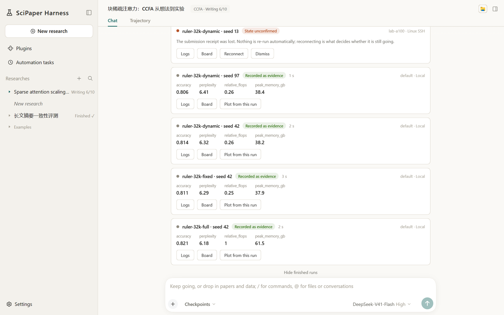
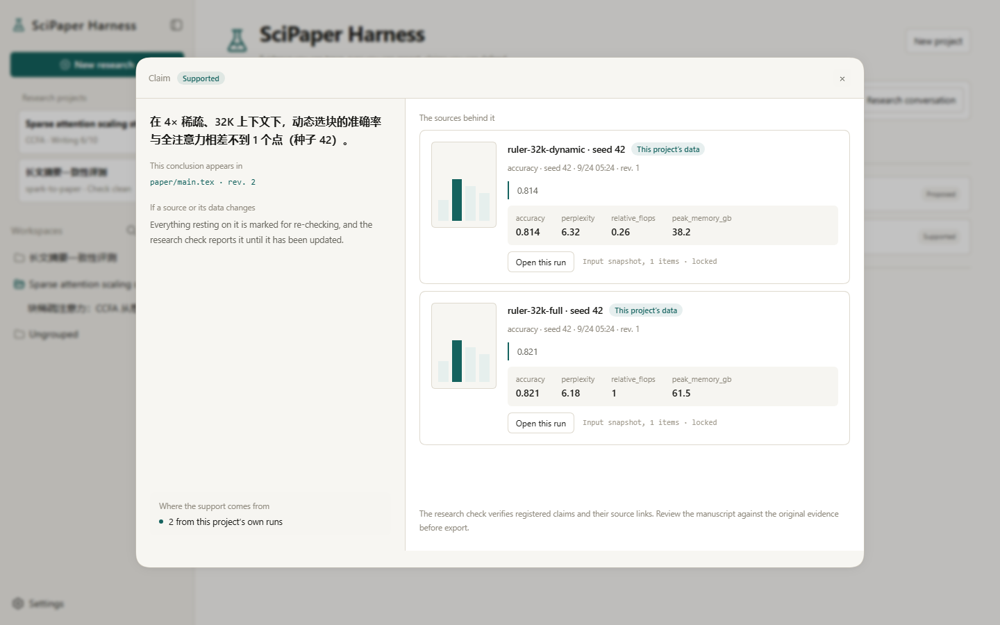
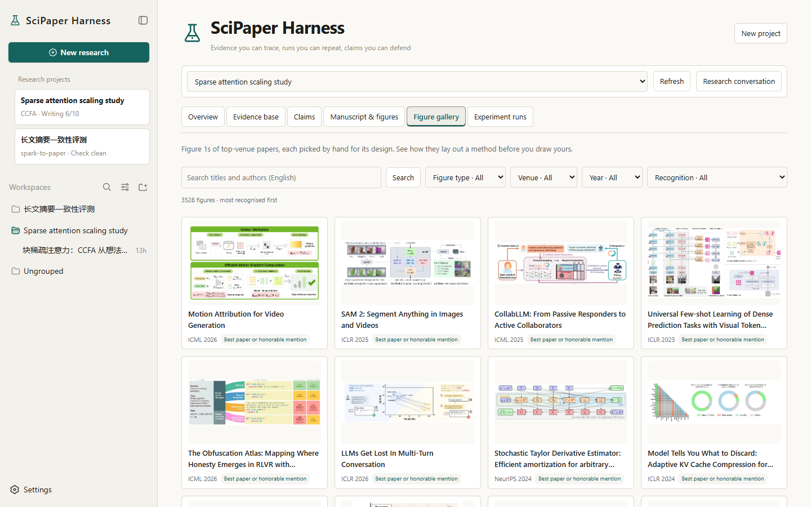

# SciPaper Harness

English | [中文](README.zh.md)

**From a spark to a paper that survives review.**

A desktop research agent that reads the literature, runs your experiments and writes the paper, and shows you the evidence behind every claim it makes.

  
  
  
  

<a href="https://github.com/M-24rjgc/SciPaper-Harness/releases"><strong>Download for Windows</strong></a>

https://github.com/user-attachments/assets/31070dc4-7744-4b20-a822-a7739fcbc639

The 90-second introduction (Chinese captions with English subtitles)

SciPaper Harness works the way a careful researcher does. It reads what is already known before committing to an idea, runs experiments instead of describing them, and writes no sentence it cannot trace back to a source or a run. This page follows one paper from its first idea to submission.

## From a spark to a paper

Two methods are built in: spark-to-paper and CCFA each guide a whole paper phase by phase, and the general mode hands you every tool with no fixed pipeline. Whichever you pick, the path looks like this.

### 1. Start with what you have

A one-line idea, a proposal, or a folder of PDFs, data and logs is enough. Every research gets a folder of its own, which you can change until the first message is sent. The switch in the composer sets how often the agent asks you: **Checkpoints** stop at key decisions, **Automatic** carries the paper through on its own.

At a fork the agent stops with a short question, its recommendation first and each option's trade-off beside it. Its checks only tell you what is still missing; they never stop you.

### 2. Find out how new the idea is

Before it writes anything, the agent recalls the closest patterns from a built-in knowledge graph of 318 problem-to-solution patterns drawn from 29,240 papers, and builds the idea card on what already exists.

The same graph is also a map. Every paper is a point, similar papers sit together, and your idea, the literature you imported and the papers the agent recalled are drawn over it. A panel beside the map says how crowded the field is around your idea and which work is closest. Mark a paper relevant or not and the agent follows your marks the next time it recalls; one switch pauses them when you want its independent view. The map shows where papers are close, never that a topic is unexplored, so its sparse areas are an optional layer, off at first.

Beside the map, the knowledge graph also keeps the relations between methods, tasks and datasets that your own sources state, each with the sentence it was taken from, and a memory of what your earlier researches left that a new research can carry.

### 3. Read the literature and cite it properly

Every reference is fetched again from Crossref, OpenAlex or arXiv and imported one paper at a time, never taken on the model's word. Open-access papers open as full text beside the conversation.

### 4. Run the experiments

Experiments run in your own Python environments, on this machine or over SSH, and keep going after you close the window. A finished run records its metrics as evidence by itself. If a run's submission receipt is lost, it shows "State unconfirmed" and waits for you to reconnect; it is never submitted a second time.

### 5. Trust every number

Open any conclusion to see the page, the quote or the runs behind it. When a source changes, everything built on it is flagged until it is brought up to date.

Until a run has finished, its table cell reads "–", so the paper never carries a figure the experiments did not produce.

### 6. Write it for the venue

Pick from 139 conference and publisher templates with their official style files. Review builds hide the author block, and every compiled page is checked.

For figures, 3,528 hand-picked Figure 1s from top venues are there to learn from, filtered by type, venue, year and award. Image drafts come from gpt-image-2, and editable SVG or draw.io figures export to vector PDF.

## On your own machine

- **Ready to run.** Python, uv and draw.io come with it and leave your own environments alone. TeX is found, not replaced: it uses the MiKTeX or TeX Live you already have, and downloads a private TinyTeX only when there is none.
- **Here or over SSH.** A remote GPU server works too, and a dropped connection is retried.
- **Nothing collected.** No telemetry and no user ID; conversations go only to the model provider you choose, whether DeepSeek, Kimi, GLM, OpenAI, Anthropic or your own gateway.
- **Your language.** Switch the interface between Chinese and English in one click; your research content stays as written.

## Get started

1. Download the installer from the [Releases page](https://github.com/M-24rjgc/SciPaper-Harness/releases).
2. Add your model provider's key in Settings.
3. Tell it what you are working on.

It keeps itself up to date, and shows a progress bar at the bottom of the sidebar while an update downloads. The [install and update guide](docs/user/guide/install-and-update.md) covers the details.

## Preview

SciPaper Harness is an internal-test preview: releases may break compatibility, and the installer is not code-signed yet. Read the [safety notice](SAFETY.md) before running it, and tell us what works and what does not in [Issues](https://github.com/M-24rjgc/SciPaper-Harness/issues).

## For developers

[Build from source](docs/user/guide/install-and-update.md#build-from-source) shows how to build the installer and publish a release; the [development guide](docs/development.md) and the [architecture documentation](docs/architecture.md) explain the code.

## Credits

SciPaper Harness stands on other people's work. Thank you to:

- [DeepSeek Harness](https://github.com/deepseek-ai/deepseek-harness) by DeepSeek, whose 0.1.6-alpha.1 release this application began from, under the MIT licence. Its later release candidates have been merged in since. SciPaper Harness is an independent project, not affiliated with or endorsed by DeepSeek.
- [Cordis](https://github.com/cordiverse/cordis) and the Cordis plugin ecosystem, the plugin framework the whole application is built on, under the MIT licence.
- [spark-to-paper-skills](https://github.com/Spark-To-Paper-Skills/spark-to-paper-skills), the method behind the spark-to-paper mode pack, and the AI research-pattern graph from which the built-in knowledge graph is distilled, under the MIT licence.
- [CCFA-Skills](https://github.com/mikubaka88/CCFA-Skills), the method behind the CCFA mode pack, and the collection of 139 venue and publisher templates, guides and examples that the venue library is built from, under the MIT licence. The style files come from each venue's official kit or publisher repository and keep their own licences.
- [Top-Conf Figure Gallery](https://github.com/qwdwqfwq/topconf-paper-figure-gallery), whose index the figure gallery ships. Every figure keeps its paper's copyright, and thanks go to the authors of those papers.
- figures4papers, whose house style for results figures the plotting guidance is distilled from.
- [draw.io](https://github.com/jgraph/drawio) by JGraph (Apache-2.0), the diagram editor; [uv](https://github.com/astral-sh/uv) by Astral (MIT or Apache-2.0), which manages the Python environments; [TinyTeX](https://github.com/rstudio/tinytex-releases) by Yihui Xie (MIT), the private TeX distribution used when none is installed; and [MiKTeX](https://miktex.org) and [TeX Live](https://tug.org/texlive/), which it uses first when you have them.
- [Crossref](https://www.crossref.org), [OpenAlex](https://openalex.org) and [arXiv](https://arxiv.org), the open services that references are verified against.
- [Electron](https://www.electronjs.org) and the many open-source libraries listed in [THIRD_PARTY_NOTICES.md](THIRD_PARTY_NOTICES.md).

Each mode pack's and library's `NOTICE.md` records exactly what was taken and what was changed.

## License

[MIT](LICENSE), keeping DeepSeek's copyright notice for the harness. Third-party dependencies and their licenses are disclosed in [THIRD_PARTY_NOTICES.md](THIRD_PARTY_NOTICES.md).
