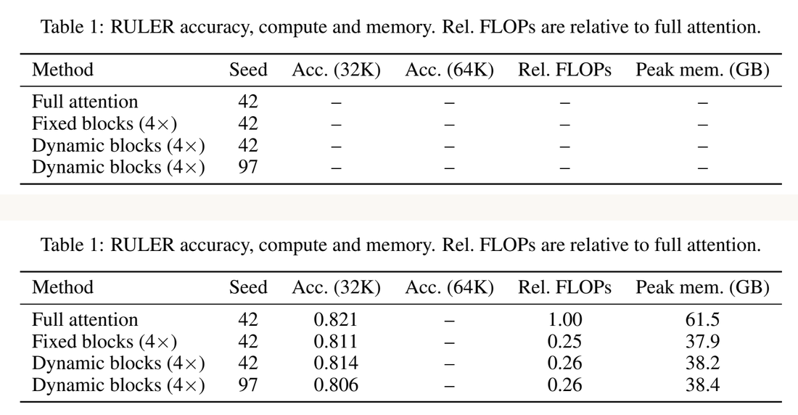

# SciPaper Harness

English | [中文](README.zh.md)

**From a spark to a paper that survives review.**

A desktop research agent that reads the literature, runs your experiments and writes the paper, and shows you the evidence behind every claim it makes.

  
  
  
  

<a href="https://github.com/M-24rjgc/SciPaper-Harness/releases"><strong>Download for Windows</strong></a>

▶ Watch the 90-second introduction (Chinese captions with English subtitles)

## Why researchers use it

- **Every claim shows its evidence.** Open any conclusion and see the page, the quote or the experiment run behind it. When a source changes, everything built on it is flagged until it is brought up to date.
- **Numbers come from real runs.** Experiments run in your own Python environments, on this machine or over SSH, and keep going after you close the window. A finished run's metrics become evidence on their own, and if a submission receipt is lost, the run is checked, never submitted twice.
- **No result, no number.** Until a run finishes, its table cell reads "–". The paper never carries a figure the experiments did not produce.
- **Start from wherever you are.** A one-line idea, a proposal, or a folder of PDFs, data and logs.
- **You decide how often it asks.** At a key decision it stops with its recommendation listed first and you choose, or you let it carry the paper through on its own. Checks tell you what is still missing; they never stop you.

## Everything a paper needs, in one place

- **Literature you can cite.** Every reference is fetched again from Crossref, OpenAlex or arXiv before it is imported, never taken on the model's word, with the open-access full text beside it.
- **Your venue's template.** 139 conference and publisher templates with their official style files. Review builds hide the author block, and every compiled page is checked.
- **Figures reviewers remember.** 3,528 hand-picked Figure 1s from top venues, filtered by type, venue, year and award; image drafts from gpt-image-2; editable SVG or draw.io figures exported to vector PDF.
- **Proven methods, built in.** spark-to-paper and CCFA guide a whole paper phase by phase; the general mode gives you every tool with no fixed pipeline.
- **A map of research ideas.** A knowledge graph of 318 problem-to-solution patterns drawn from 29,240 papers finds the closest work and tells you how new your idea is.

## Ready for a research PC

- **Python, uv and draw.io come with it.** Experiments and figures work out of the box and leave your own environments alone.
- **TeX is found, not replaced.** It uses the MiKTeX or TeX Live you already have, and downloads a private TinyTeX only when there is none.
- **Run here or over SSH.** A remote GPU server works too, and a dropped connection is retried.
- **No data collection.** No telemetry and no user ID; conversations go only to the model provider you choose.
- **Your choice of model.** DeepSeek, Kimi, GLM, OpenAI, Anthropic or your own gateway.
- **Chinese and English.** Switch the interface in one click; your research content stays as written.

## See it work

**It asks at the decisions that matter.** When the agent reaches a fork it stops with a short question, its recommendation listed first and the trade-off of each option beside it. The composer's Checkpoints / Automatic switch decides how often that happens for the whole research.

**It checks how new your idea is.** Before writing, the agent recalls the closest patterns from the built-in knowledge graph and builds the idea card on what already exists.

**Every reference is fetched again.** Each paper is looked up by DOI, checked and imported one by one; open-access papers open as full text beside the conversation.

**Experiments are runs, and runs are evidence.** A finished run records its metrics as evidence. If a run's submission receipt is lost, it shows "State unconfirmed" and waits for you to reconnect; it is never submitted a second time.

**No result yet, no number.** The same table, compiled before and after the 32K runs finished. The 64K column stays "–" until those runs exist.

## Get started

1. Download the installer from the [Releases page](https://github.com/M-24rjgc/SciPaper-Harness/releases).
2. Add your model provider's key in Settings.
3. Tell it what you are working on.

It keeps itself up to date, and shows a progress bar at the bottom of the sidebar while an update downloads. The [install and update guide](docs/user/guide/install-and-update.md) covers the details.

## Preview

SciPaper Harness is an internal-test preview: releases may break compatibility, and the installer is not code-signed yet. Read the [safety notice](SAFETY.md) before running it, and tell us what works and what does not in [Issues](https://github.com/M-24rjgc/SciPaper-Harness/issues).

## For developers

[Build from source](docs/user/guide/install-and-update.md#build-from-source) shows how to build the installer and publish a release; the [development guide](docs/development.md) and the [architecture documentation](docs/architecture.md) explain the code.

## Credits

SciPaper Harness stands on other people's work. Thank you to:

- [DeepSeek Harness](https://github.com/deepseek-ai/deepseek-harness) by DeepSeek, whose 0.1.6-alpha.1 release this application began from, under the MIT licence. Its later release candidates have been merged in since. SciPaper Harness is an independent project, not affiliated with or endorsed by DeepSeek.
- [Cordis](https://github.com/cordiverse/cordis) and the Cordis plugin ecosystem, the plugin framework the whole application is built on, under the MIT licence.
- [spark-to-paper-skills](https://github.com/Spark-To-Paper-Skills/spark-to-paper-skills), the method behind the spark-to-paper mode pack, and the AI research-pattern graph from which the built-in knowledge graph is distilled, under the MIT licence.
- [CCFA-Skills](https://github.com/mikubaka88/CCFA-Skills), the method behind the CCFA mode pack, and the collection of 139 venue and publisher templates, guides and examples that the venue library is built from, under the MIT licence. The style files come from each venue's official kit or publisher repository and keep their own licences.
- [Top-Conf Figure Gallery](https://github.com/qwdwqfwq/topconf-paper-figure-gallery), whose index the figure gallery ships. Every figure keeps its paper's copyright, and thanks go to the authors of those papers.
- figures4papers, whose house style for results figures the plotting guidance is distilled from.
- [draw.io](https://github.com/jgraph/drawio) by JGraph (Apache-2.0), the diagram editor; [uv](https://github.com/astral-sh/uv) by Astral (MIT or Apache-2.0), which manages the Python environments; [TinyTeX](https://github.com/rstudio/tinytex-releases) by Yihui Xie (MIT), the private TeX distribution used when none is installed; and [MiKTeX](https://miktex.org) and [TeX Live](https://tug.org/texlive/), which it uses first when you have them.
- [Crossref](https://www.crossref.org), [OpenAlex](https://openalex.org) and [arXiv](https://arxiv.org), the open services that references are verified against.
- [Electron](https://www.electronjs.org) and the many open-source libraries listed in [THIRD_PARTY_NOTICES.md](THIRD_PARTY_NOTICES.md).

Each mode pack's and library's `NOTICE.md` records exactly what was taken and what was changed.

## License

[MIT](LICENSE), keeping DeepSeek's copyright notice for the harness. Third-party dependencies and their licenses are disclosed in [THIRD_PARTY_NOTICES.md](THIRD_PARTY_NOTICES.md).
