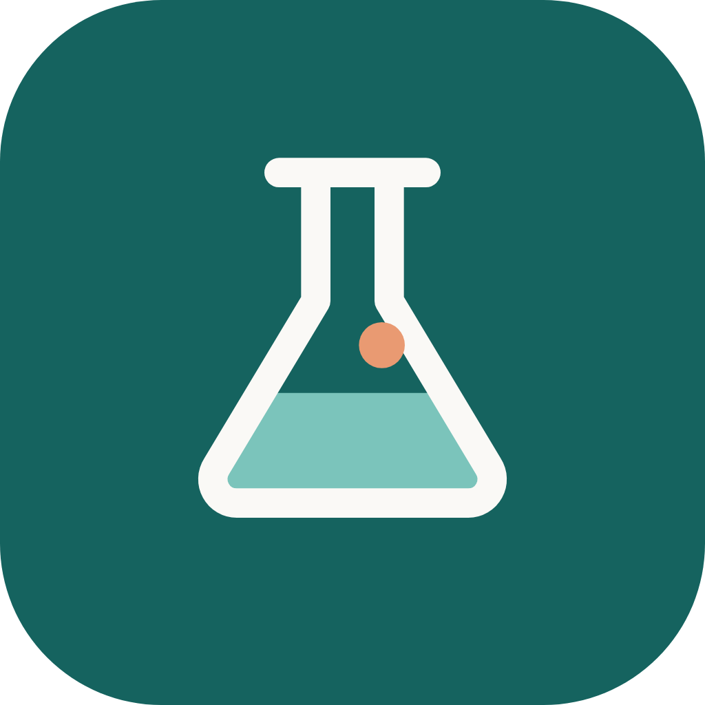
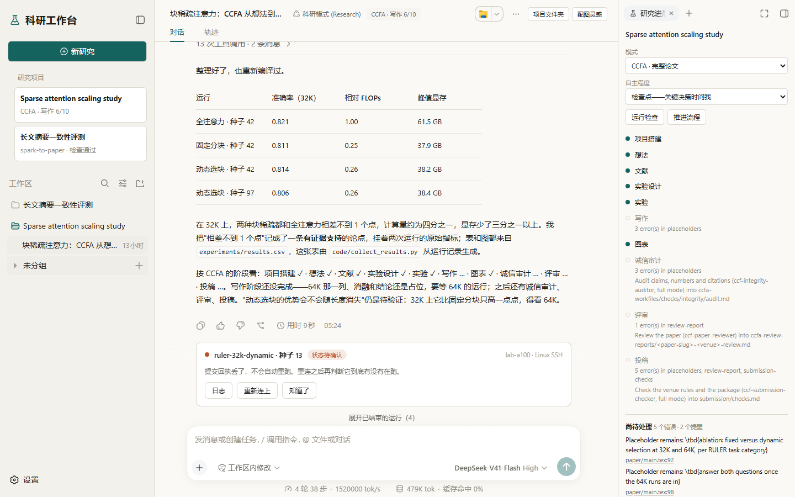
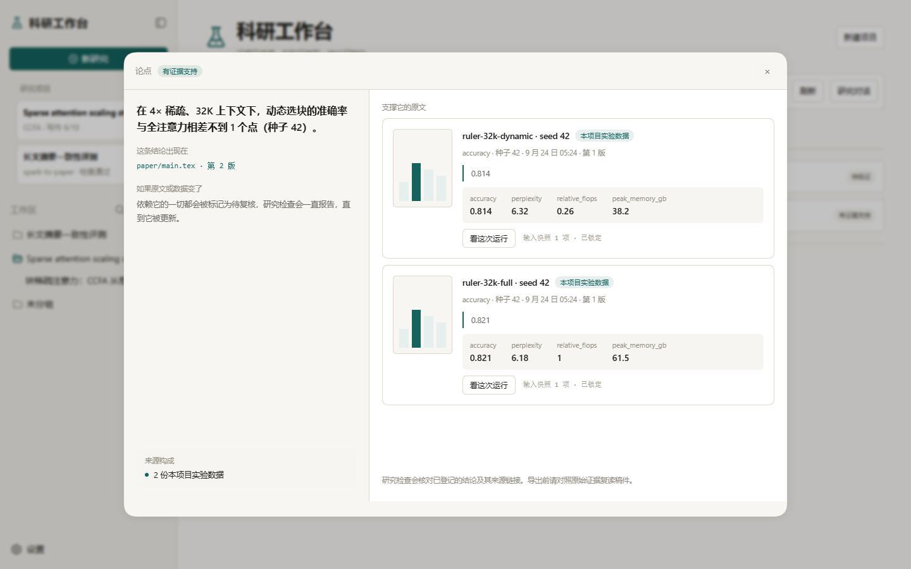
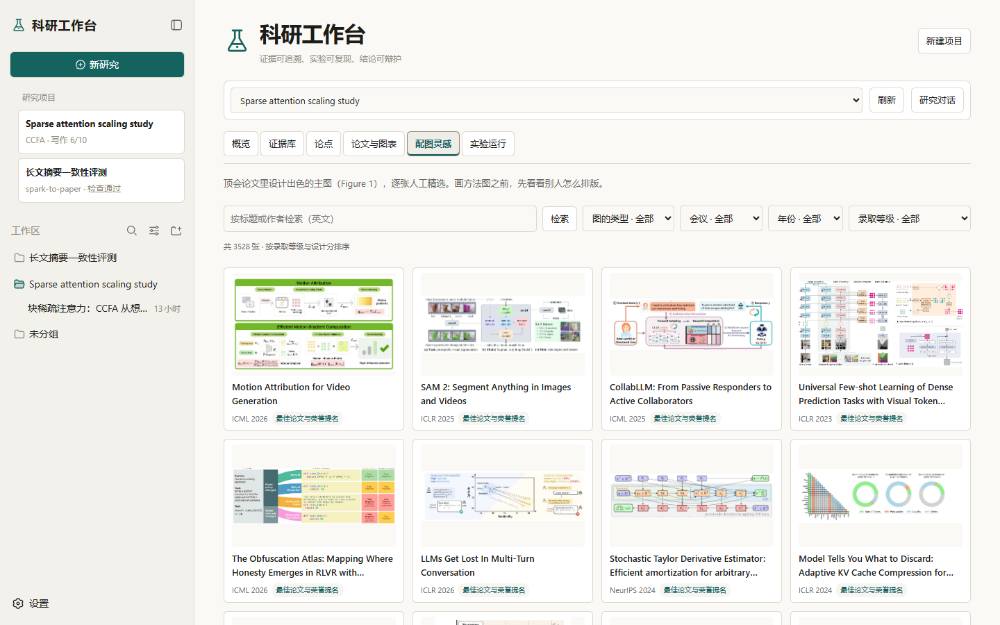
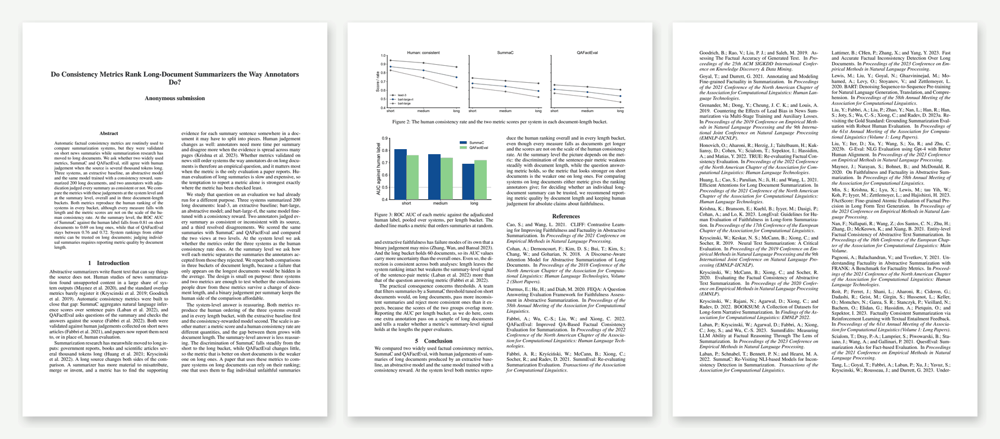

# SciPaper Harness · 科研工作台

[English](README.md) | 中文

**从一个灵感，到一篇经得起审稿的论文。**

一个桌面科研 agent：替你读文献、跑实验、写论文，并为它写下的每一个结论拿出证据。

  
  
  
  

<a href="https://github.com/M-24rjgc/SciPaper-Harness/releases"><strong>下载 Windows 版</strong></a>

## 为什么选它

- **每个结论都拿得出证据。** 点开任何一条结论，就能看到它背后的那一页原文、那句引文或那次实验运行。原始资料一旦变了，依赖它的一切都会被标出来，直到更新为止。
- **数字来自真实的实验运行。** 实验在你自己的 Python 环境里运行，本机或 SSH 远程都行；关掉窗口也照样跑完，表格里的每个数字都能追溯到产生它的那次运行。
- **从你手头有的开始。** 一句话的想法、一份提案，或者一文件夹的 PDF、数据和日志，都可以。
- **多久问你一次，由你决定。** 在关键决策处停下来问你，或者放手让它一路写完。

## 一篇论文需要的，都在这里

- **引得放心的文献。** 参考文献经 Crossref、OpenAlex 与 arXiv 核实，开放获取的全文就在旁边。
- **你要投的会议模板。** 139 个 CCF 会议的官方样式，编译后逐页检查。
- **让审稿人记住的图。** 约 3,500 张人工精选的顶会主图可供参考，gpt-image-2 出草图，再做成可编辑的 SVG 或 draw.io 图，导出矢量 PDF。
- **成熟的方法，开箱即用。** spark-to-paper 和 CCFA 按阶段带你写完整篇论文；通用模式给你全部工具，不设固定流程。
- **一张研究思路的地图。** 由「问题 → 解法」模式组成的知识图谱，帮你找到最接近的工作，并告诉你的想法有多新。

## 开始使用

1. 在 [Releases 页面](https://github.com/M-24rjgc/SciPaper-Harness/releases)下载安装包。
2. 在设置里填写模型服务商的密钥。
3. 告诉它你在研究什么。

它会自己保持最新。更多细节见[安装与更新指南](docs/user/guide/install-and-update.zh.md)。

## 预览版

SciPaper Harness 目前是内测预览版：新版本可能不兼容旧版本，安装包也还没有代码签名。运行前请先阅读[安全须知](SAFETY.zh.md)；好用或不好用的地方，都欢迎在 [Issues](https://github.com/M-24rjgc/SciPaper-Harness/issues) 里告诉我们。

## 开发者

[从源码构建](docs/user/guide/install-and-update.zh.md#build-from-source)介绍如何构建安装包并发布版本；[开发指南](docs/development.zh.md)和[架构文档](docs/architecture.zh.md)讲解代码。

## 致谢

- DeepSeek 开发的 [DeepSeek Harness](https://github.com/deepseek-ai/deepseek-harness)，本软件起步于它的 0.1.6-alpha.1 版本，采用 MIT 许可。SciPaper Harness 是独立项目，与 DeepSeek 没有关联，也未获其认可。
- [spark-to-paper-skills](https://github.com/Spark-To-Paper-Skills/spark-to-paper-skills) 与 [CCFA-Skills](https://github.com/mikubaka88/CCFA-Skills)，两个模式包所依据的方法，采用 MIT 许可；详见各模式包的 `NOTICE.md`。
- [Top-Conf Figure Gallery](https://github.com/qwdwqfwq/topconf-paper-figure-gallery)，配图库随包附带的是它的索引；每张图的版权归其论文所有。

## 许可

[MIT](LICENSE)，保留 DeepSeek 对框架部分的版权声明。第三方依赖及其许可见 [THIRD_PARTY_NOTICES.md](THIRD_PARTY_NOTICES.md)。
