

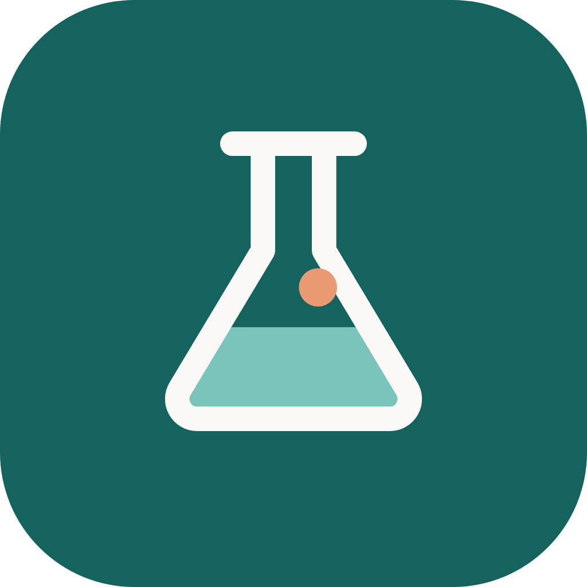

# SciPaper Harness · 科研工作台

[English](README.md) | 中文

**从一个灵感，到一篇经得起审稿的论文。**

一个桌面科研 agent：替你读文献、跑实验、写论文，并为它写下的每一个结论拿出证据。

  
  
  
  

<a href="https://github.com/M-24rjgc/SciPaper-Harness/releases"><strong>下载 Windows 版</strong></a>

https://github.com/user-attachments/assets/31070dc4-7744-4b20-a822-a7739fcbc639

90 秒介绍视频（中文字幕，附英文小字）

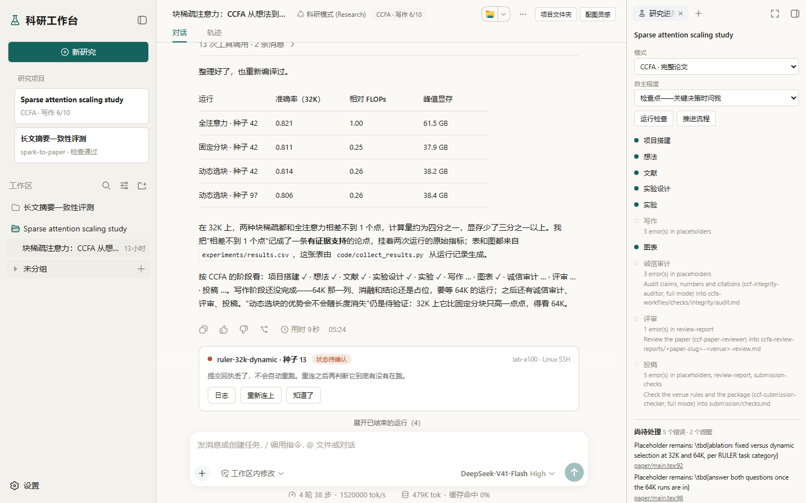

科研工作台的工作方式，像一位严谨的研究者：动笔前先读已有的工作，实验是真的去跑而不是描述，写下的每一句话都能追溯到一份资料或一次运行。这一页跟着一篇论文，从第一个想法走到投稿。

## 从一个灵感到一篇论文

内置两套方法：spark-to-paper 和 CCFA 都按阶段带你写完整篇论文；通用模式把全部工具交给你，不设固定流程。无论选哪一个，路径都是这样的。

### 1. 从你手头有的开始

一句话的想法、一份提案，或者一文件夹的 PDF、数据和日志，都可以。每项研究有自己的文件夹，发出第一条消息之前都可以换位置。输入框里的开关决定 agent 多久问你一次：**检查点**在关键决策处停下来，**全自动**放手让它一路写完。

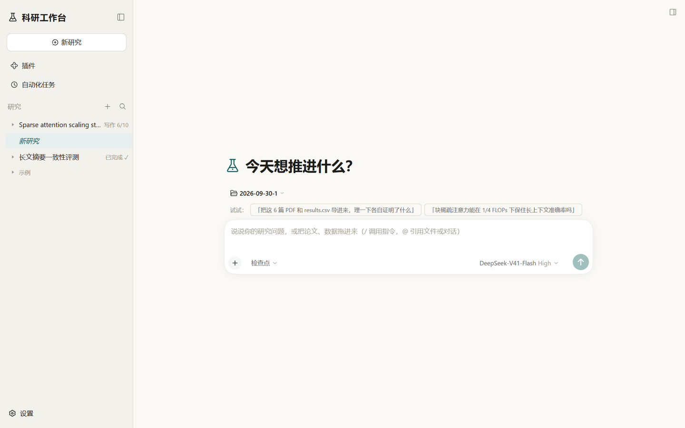

走到分岔口，agent 会停下来提一个简短的问题，推荐项排在第一位，每个选项旁边写着代价。它的检查只告诉你还缺什么，从不拦着你。

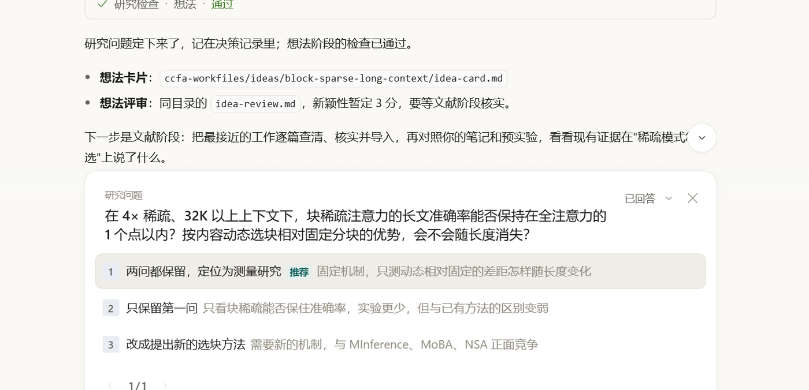

### 2. 先看想法有多新

动笔之前，agent 先从内置知识图谱里召回最接近的模式：图谱收录了从 29,240 篇论文中提炼的 318 个「问题 → 解法」模式。想法卡片就建立在已有的工作之上。

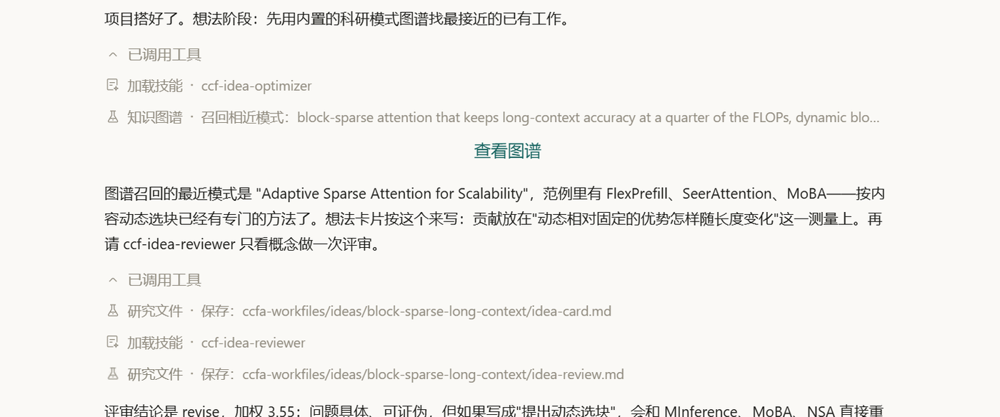

### 3. 读文献，引得放心

每条参考文献都从 Crossref、OpenAlex 或 arXiv 重新取回，一次导入一篇，不凭模型一句话。开放获取的论文可以在对话旁直接打开全文。

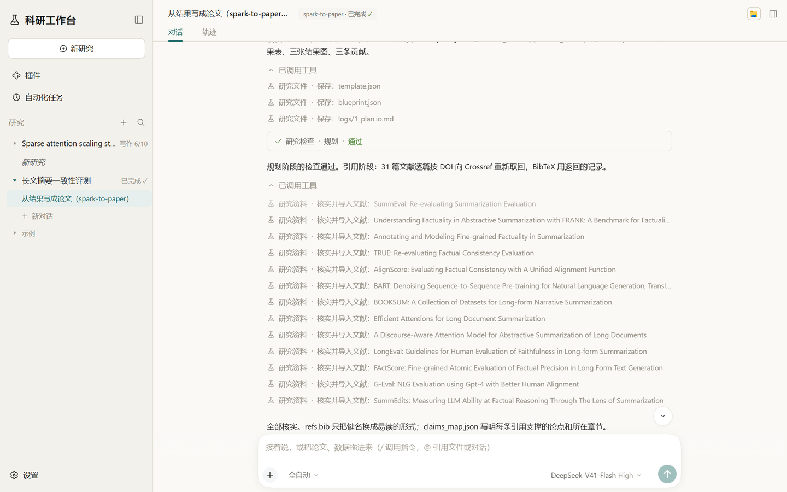

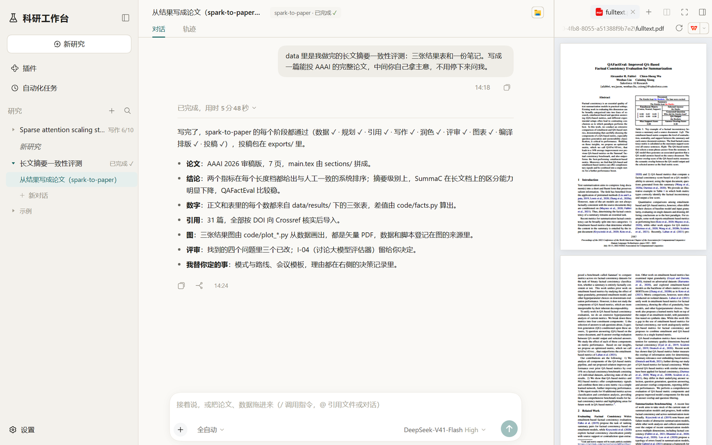

### 4. 跑实验

实验在你自己的 Python 环境里运行，本机或 SSH 远程都行，关掉窗口也照样跑完。跑完的运行会自动把指标记为证据。提交回执丢了的运行会显示「状态待确认」，等你重新连接后再判断，绝不会再提交一次。

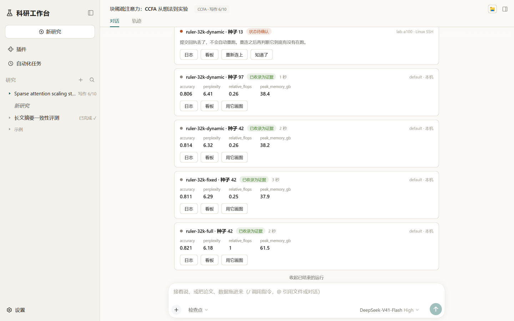

### 5. 每个数字都信得过

点开任何一条结论，就能看到它背后的那一页原文、那句引文或那几次运行。原始资料一旦变了，依赖它的一切都会被标出来，直到更新为止。

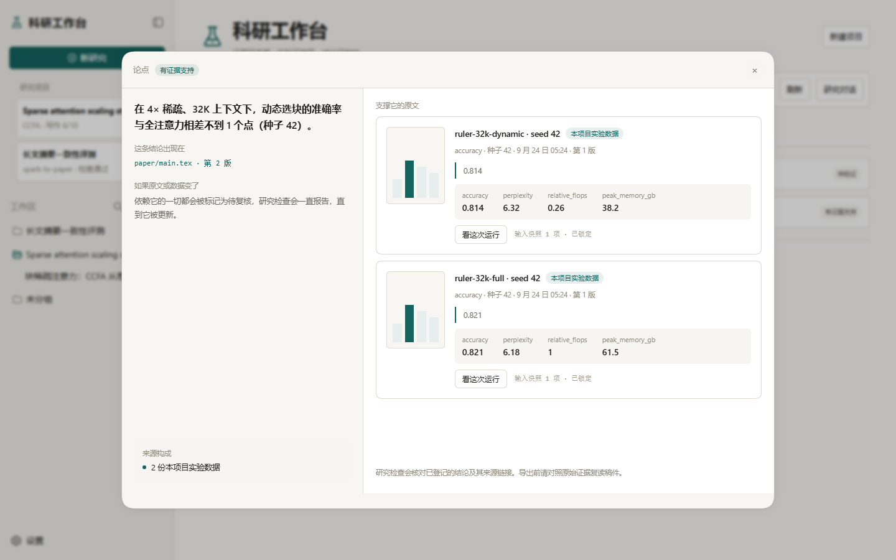

实验没跑完，表格里就留「–」，论文里不会出现实验没有产出的数字。

### 6. 按你要投的会议写出来

139 个会议与出版模板任你选，附官方样式文件。审稿版自动隐去作者信息，编译后逐页检查。

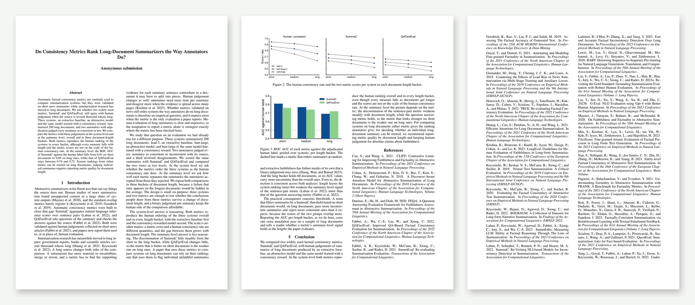

配图方面，有 3,528 张人工精选的顶会主图可供参考，可按类型、会议、年份和获奖筛选。gpt-image-2 出草图，再做成可编辑的 SVG 或 draw.io 图，导出矢量 PDF。

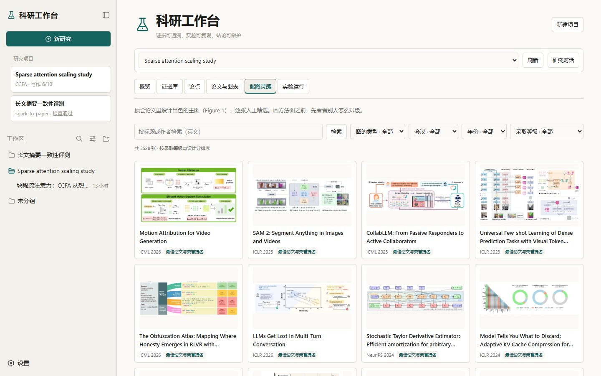

## 在你自己的电脑上

- **装好就能跑。** 自带 Python、uv 与 draw.io，不动你电脑上原有的环境。TeX 自动识别，不另起炉灶：优先使用你已装的 MiKTeX 或 TeX Live，一个都没有时，才下载一份私有的 TinyTeX。
- **本机或 SSH。** 远程 GPU 服务器也行，断网会自动重试。
- **不收集任何数据。** 没有遥测，没有用户 ID；对话只发给你自己选的模型服务商，DeepSeek、Kimi、GLM、OpenAI、Anthropic 或你自己的网关都可以。
- **你的语言。** 界面一键切换中文和英文，研究内容保持原样。

## 开始使用

1. 在 [Releases 页面](https://github.com/M-24rjgc/SciPaper-Harness/releases)下载安装包。
2. 在设置里填写模型服务商的密钥。
3. 告诉它你在研究什么。

它会自己保持最新，下载更新时侧栏底部会显示进度条。更多细节见[安装与更新指南](docs/user/guide/install-and-update.zh.md)。

## 预览版

SciPaper Harness 目前是内测预览版：新版本可能不兼容旧版本，安装包也还没有代码签名。运行前请先阅读[安全须知](SAFETY.zh.md)；好用或不好用的地方，都欢迎在 [Issues](https://github.com/M-24rjgc/SciPaper-Harness/issues) 里告诉我们。

## 开发者

[从源码构建](docs/user/guide/install-and-update.zh.md#build-from-source)介绍如何构建安装包并发布版本；[开发指南](docs/development.zh.md)和[架构文档](docs/architecture.zh.md)讲解代码。

## 致谢

科研工作台站在许多人的工作之上，感谢：

- DeepSeek 开发的 [DeepSeek Harness](https://github.com/deepseek-ai/deepseek-harness)：本软件起步于它的 0.1.6-alpha.1 版本，此后又合并了它的后续候选版本，采用 MIT 许可。SciPaper Harness 是独立项目，与 DeepSeek 没有关联，也未获其认可。
- [Cordis](https://github.com/cordiverse/cordis) 及其插件生态：整个应用建立在这套插件框架之上，采用 MIT 许可。
- [spark-to-paper-skills](https://github.com/Spark-To-Paper-Skills/spark-to-paper-skills)：spark-to-paper 模式包所依据的方法，内置知识图谱也是从它的 AI 研究模式图谱中提炼而来，采用 MIT 许可。
- [CCFA-Skills](https://github.com/mikubaka88/CCFA-Skills)：CCFA 模式包所依据的方法，以及会议模板库所用的 139 个会议与出版模板、指南和示例，采用 MIT 许可。样式文件来自各会议的官方模板或出版社仓库，各自保留原有许可。
- [Top-Conf Figure Gallery](https://github.com/qwdwqfwq/topconf-paper-figure-gallery)：配图库随包附带它的索引。每张图的版权归其论文所有，感谢这些论文的作者。
- figures4papers：结果图绘制指引的风格提炼自它。
- [draw.io](https://github.com/jgraph/drawio)（JGraph，Apache-2.0）图表编辑器；[uv](https://github.com/astral-sh/uv)（Astral，MIT 或 Apache-2.0），用来管理 Python 环境；[TinyTeX](https://github.com/rstudio/tinytex-releases)（谢益辉，MIT），本机没有 TeX 时使用的私有发行版；以及 [MiKTeX](https://miktex.org) 与 [TeX Live](https://tug.org/texlive/)，你装了它们时优先使用。
- [Crossref](https://www.crossref.org)、[OpenAlex](https://openalex.org) 和 [arXiv](https://arxiv.org)：核实参考文献所依据的开放服务。
- [Electron](https://www.electronjs.org)，以及 [THIRD_PARTY_NOTICES.md](THIRD_PARTY_NOTICES.md) 中列出的众多开源库。

每个模式包和资源库的 `NOTICE.md` 都记录了具体取用了什么、改动了什么。

## 许可

[MIT](LICENSE)，保留 DeepSeek 对框架部分的版权声明。第三方依赖及其许可见 [THIRD_PARTY_NOTICES.md](THIRD_PARTY_NOTICES.md)。
